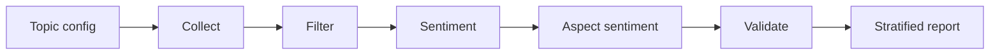
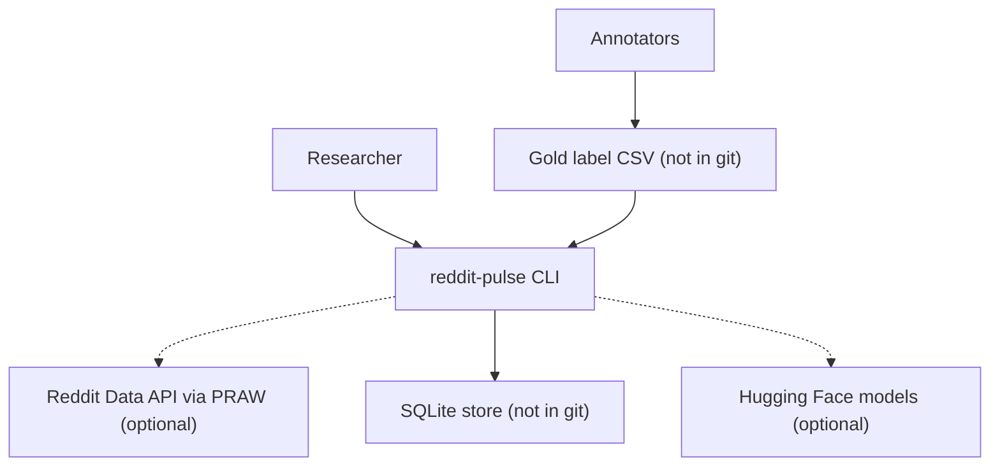
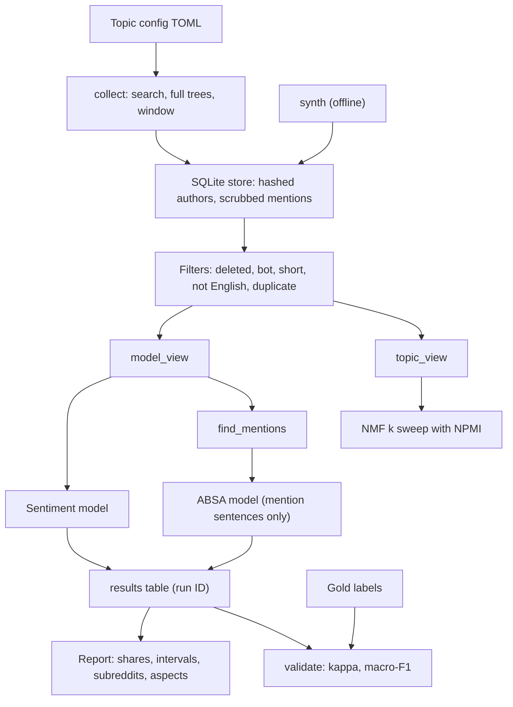

<div align="center">

# reddit-pulse — Validated Sentiment, Aspect Sentiment and Topics for Reddit Policy Debates

**reddit-pulse is a discourse-analysis pipeline for researchers who study Reddit discussions of public policy. It takes a topic config through these steps to a validated, subreddit-stratified report:**

`collect` → `filter` → `two text views` → `sentiment` → `aspect sentiment` → `topics` → `validate` → `report`.


**[Summary](#1-summary)** ·
**[Workflow](#4-the-end-to-end-workflow)** ·
**[Run it](#10-how-to-run-reddit-pulse)** ·
**[Configuration](#104-environment-variables)** ·
**[Known problems](#13-known-problems)** ·
**[Glossary](#15-glossary)**

</div>

> [!NOTE]
> This README uses ASD-STE100 Simplified Technical English. The writing rules and the project
> vocabulary are in [`docs/ste-style-guide.md`](docs/ste-style-guide.md). Each term in the
> [Glossary](#15-glossary) has only one meaning.

---

reddit-pulse runs one pipeline for each topic config. The models read the full text with negations and punctuation, and only the topic model reads stop-word-free tokens.
Aspect sentiment runs only on sentences that name the aspect. Neutral stays neutral, and a failed prediction is a count, not a label.
Each result has a 95% bootstrap interval and a split by subreddit. Hand labels give Cohen's kappa and the macro-F1 of each model.
The offline demo and all tests use synthetic comments with known labels. They need no Reddit account, no model and no network.

This README is the **one location that explains all of reddit-pulse**. It gives these topics:

- the general design
- each component and its procedure, step by step
- the decision rules
- the data map
- the runbook
- the validation results and the known problems

| If you are… | Read |
|---|---|
| A manager or reviewer | [1](#1-summary), [3](#3-design-rules), [4](#4-the-end-to-end-workflow), [12](#12-validation-results), [14](#14-key-points) |
| A developer who joins the project | All sections, in sequence. Keep [10](#10-how-to-run-reddit-pulse) and [13](#13-known-problems) open while you work |
| An operator who runs reddit-pulse | [10](#10-how-to-run-reddit-pulse), then the section for the component that you use |

---

## Table of contents

1. 🧭 [Summary](#1-summary)
2. 🏗️ [How reddit-pulse is built](#2-how-reddit-pulse-is-built)
   - 2.1 [Components](#21-components)
   - 2.2 [System context](#22-system-context)
   - 2.3 [Repository layout](#23-repository-layout)
3. 🛡️ [Design rules](#3-design-rules)
4. 🔄 [The end-to-end workflow](#4-the-end-to-end-workflow)
   - 4.1 [Full flow](#41-full-flow)
   - 4.2 [The life cycle of one comment](#42-the-life-cycle-of-one-comment)
5. 🔵 [Collection, store and filters](#5-collection-store-and-filters)
6. 🟢 [Sentiment and aspect sentiment](#6-sentiment-and-aspect-sentiment)
7. 🟣 [Topics, validation and reports](#7-topics-validation-and-reports)
8. ⚖️ [The decision rules](#8-the-decision-rules)
9. 🗂️ [Data and file map](#9-data-and-file-map)
10. ▶️ [How to run reddit-pulse](#10-how-to-run-reddit-pulse)
    - 10.1 [Prerequisites](#101-prerequisites) · 10.2 [Installation](#102-installation) · 10.3 [Run reddit-pulse](#103-run-reddit-pulse) · 10.4 [Environment variables](#104-environment-variables)
11. 🧩 [How to extend reddit-pulse](#11-how-to-extend-reddit-pulse)
12. ✅ [Validation results](#12-validation-results)
13. ⚠️ [Known problems](#13-known-problems)
14. 📌 [Key points](#14-key-points)
15. 📖 [Glossary](#15-glossary)
16. 📄 [License](#16-license)

---

## 1. Summary

**The problem.** A researcher wants to know how Reddit users discuss a policy topic, and how sure the numbers are. These questions are difficult:

- How do you collect a sample that is the same for each topic?
- How do you clean the text for topics without a change of the sentiment?
- How do you measure the opinion about one aspect, for example ICE, and not the general tone?
- How accurate is a sentiment model on political Reddit text?
- How do you keep usernames out of the data?

reddit-pulse gives each of these questions its own component. Each component has a validated input and a tested output.

| Item | Value |
|---|---|
| Input | A topic config (subreddits, queries, date window, aspects), then the collected comments |
| Output | Results for each comment, a report with shares, intervals, subreddit splits and aspect tables, topics, validation scores |
| Components | **12** modules: config, collect, store, clean, legacy, sentiment, absa, topics, validate, report, pipeline, synthetic (plus `cli`) |
| Models | `lexicon` (offline), any Hugging Face sentiment or ABSA classifier (optional) |
| Offline mode | Synthetic comments, the lexicon models, NMF topics and SQLite. No account, no key and no network |
| Safety | Credentials only from the environment, salted author hashes, mention scrubbing, no data in git |
| Tests | **24** unit tests (`pytest`). CI installs only `.[dev]`: **23** pass and 1 skips (the model test). With `PULSE_TEST_HF=1` and the `transformers` extra: 24 pass |



---

## 2. How reddit-pulse is built

### 2.1 Components

| Component | Module | Purpose |
|---|---|---|
| Settings and topic configs | `src/reddit_pulse/config.py` | Environment variables, TOML topic configs, aspect patterns |
| Collector | `src/reddit_pulse/collect.py` | PRAW search, full comment trees, date window, back-off |
| Store | `src/reddit_pulse/store.py` | SQLite tables, author hashes, mention scrubbing |
| Cleaning | `src/reddit_pulse/clean.py` | Model view, topic view, filters |
| Old cleaning | `src/reddit_pulse/legacy.py` | A copy of the old cleaning, only for the comparison |
| Sentiment | `src/reddit_pulse/sentiment.py` | Lexicon model with negation scope, Hugging Face model |
| Aspect sentiment | `src/reddit_pulse/absa.py` | Mention finder, lexicon ABSA, Hugging Face ABSA |
| Topics | `src/reddit_pulse/topics.py` | Seeded NMF, NPMI coherence, k sweep, optional BERTopic |
| Validation | `src/reddit_pulse/validate.py` | Gold labels, kappa, adjudication, macro-F1 with interval, label sample |
| Report | `src/reddit_pulse/report.py` | Shares with bootstrap intervals, subreddit and aspect tables, Markdown |
| Pipeline | `src/reddit_pulse/pipeline.py` | One run for any topic, stored with a run ID |
| Synthetic data | `src/reddit_pulse/synthetic.py` | Labelled comments, bots, duplicates, simulated annotators |
| CLI | `src/reddit_pulse/cli.py` | The `reddit-pulse` command with 9 subcommands |

### 2.2 System context



### 2.3 Repository layout

```
reddit-pulse/
├── .github/workflows/ci.yml       # CI: Python 3.11, pip install -e ".[dev]", pytest -q
├── .env.example                   # 8 environment variable names, no values
├── pyproject.toml                 # package, extras reddit, transformers, bertopic, dev
├── configs/topics/                # ice-raids, tariffs, lgbtq-rights, birthright-citizenship (TOML)
├── labels/GUIDELINES.md           # annotation rules
├── data/README.md                 # source, terms, store tables, models
├── docs/ste-style-guide.md        # writing rules and project vocabulary
├── src/reddit_pulse/
│   ├── config.py  collect.py  store.py        # input
│   ├── clean.py  legacy.py                     # text views and the old cleaning
│   ├── sentiment.py  absa.py  topics.py        # models
│   ├── validate.py  report.py  pipeline.py     # quality and output
│   ├── synthetic.py  cli.py
└── tests/                                     # 24 tests, no network, no API keys
```

---

## 3. Design rules

### 3.1 Credentials and usernames stay out of the code and the data
The collector reads the Reddit credentials only from the environment. It stores each author as a salted HMAC and replaces each `u/` mention in the text. A test reads the raw database file and finds no username.

### 3.2 Two text views
`model_view` keeps case, punctuation, emojis and negations, and replaces only links and mentions. `topic_view` removes stop words for the topic model only. Thus "not good" stays negative.

### 3.3 Neutral stays neutral
No step changes a neutral label. The pipeline is deterministic: two runs on the same comments give the same run ID and the same results.

### 3.4 Aspect sentiment needs a mention
`find_mentions` applies the aspect patterns of the topic config to each sentence. Only a sentence with a match goes to the ABSA model. The pattern for ICE is case-sensitive, so "ice" in lower case does not match.

### 3.5 A failure is a count, not a label
A model error gives the status `failed` for each comment of the batch. The report shows the failed count apart from the label shares.

### 3.6 Each number has an interval and a split
Each share has a 95% bootstrap interval and its count. The report gives each subreddit apart, because each subreddit has its own lean.

### 3.7 Models are validated on hand labels
`validate` gives Cohen's kappa between two annotators and the macro-F1 of the model against the adjudicated labels, with a 95% interval.

---

## 4. The end-to-end workflow

### 4.1 Full flow



### 4.2 The life cycle of one comment

1. The collector finds the comment in the full tree of a thread inside the date window.
2. The store saves it with a hashed author and a scrubbed text. A known `comment_id` is ignored.
3. The filters drop it if it is deleted, from a bot, too short, not English or a duplicate.
4. `model_view` replaces links and mentions. The sentiment model gives a label and a score.
5. `find_mentions` looks for each aspect pattern in each sentence.
6. Each matching sentence goes to the ABSA model with the aspect name.
7. The pipeline writes one result row with the label, the status and the aspect list.
8. The report counts the row in the overall shares, its subreddit shares and each aspect table.

---

## 5. Collection, store and filters

**Purpose.** Collect a comparable sample for each topic and keep only usable comments.

| Input | Output |
|---|---|
| Topic config and credentials | `comments` rows in SQLite |
| Stored comments | Kept comments and a count for each filter reason |

**Procedure**

1. `TopicConfig.from_toml` checks the dates, the subreddits, the queries and each aspect pattern.
2. `RedditCollector` searches each subreddit with each query, sorted by new, up to `max_threads_per_query` threads.
3. It keeps threads and comments with a date inside the window, and reads each tree with `replace_more(limit=None)`.
4. A rate-limit error gets a wait of 2, 4, 8 and 16 seconds before the next try.
5. The store saves the comment with `INSERT OR IGNORE`, so a new collection never makes a duplicate row.
6. `filter_comments` gives each comment one reason in this order: `deleted`, `bot`, `too_short`, `not_english`, `duplicate`, or keeps it.

---

## 6. Sentiment and aspect sentiment

**Purpose.** Give each kept comment a sentiment, and each aspect mention an aspect sentiment.

| Input | Output |
|---|---|
| Model views of the kept comments | `Prediction` (label, score, status) for each comment |
| Mention sentences and aspect names | `Prediction` for each mention |

**Procedure**

1. `LexiconSentiment` adds the word values of an 89-word lexicon.
2. A negator in the 3 tokens before a word multiplies its value by -0.75. An intensifier multiplies it by its factor.
3. After "but", values count 1.5 times. Before "but", values count 0.5 times.
4. The sum is normalised to (-1, 1). Above 0.05 is positive, below -0.05 is negative.
5. `TransformerSentiment` runs a Hugging Face classifier in batches of 32 with truncation at 256 tokens.
6. `find_mentions` splits the text into sentences and applies each aspect pattern.
7. `LexiconAbsa` scores the mention sentence. `TransformerAbsa` scores the pair (sentence, aspect).

---

## 7. Topics, validation and reports

**Purpose.** Find the themes, measure the quality of the models and write the report.

| Input | Output |
|---|---|
| Topic views | `TopicResult`: k, top words, sizes, NPMI for each k |
| Gold CSV and results | Kappa, adjudicated gold, accuracy, macro-F1 with an interval, confusion |
| Results | Report JSON or Markdown |

**Procedure**

1. `sweep_topics` fits NMF on TF-IDF for each k from 2 to 8 with a fixed seed.
2. For each k, it calculates the mean NPMI of the top-8 word pairs with document counts.
3. It keeps the k with the highest NPMI.
4. `sample_for_labels` takes the same number of comments from each subreddit for annotation.
5. `agreement` calculates Cohen's kappa of the first two annotators. `adjudicate` keeps the majority label and leaves out ties.
6. `score_model` gives accuracy, macro-F1, a 95% bootstrap interval (1000 resamples) and the confusion matrix.
7. `build_report` gives the shares and intervals overall, for each subreddit and for each aspect.

---

## 8. The decision rules

| Rule | Value | Where |
|---|---|---|
| Sentiment labels | `negative`, `neutral`, `positive` | `sentiment.LABELS` |
| Lexicon thresholds | compound > 0.05 positive, < -0.05 negative | `LexiconSentiment` |
| Negation scope | 3 tokens before the word, factor -0.75 | `lexicon_compound` |
| "but" rule | 0.5 before, 1.5 after | `lexicon_compound` |
| Too short | Fewer than 3 words | `filter_reason` |
| Not English | 8 words or more, and fewer than 5% common English words | `is_english` |
| Duplicate | Same lower-case words and digits after `model_view` | `dedupe_key` |
| Bot | Author `AutoModerator` or ending in `bot`, or bot text | `is_bot`, collector |
| Author hash | HMAC-SHA256 with `PULSE_HASH_SALT`, first 16 hex digits | `hash_author` |
| Topic k | 2 to 8, highest mean NPMI | `sweep_topics` |
| Intervals | 95% percentile bootstrap, 1000 resamples | `shares`, `score_model` |
| Gold label | Majority of annotators. Ties left out and counted | `adjudicate` |
| Run ID | SHA-1 of topic, parameters and kept comment IDs (12 hex) | `pipeline.run` |

---

## 9. Data and file map

| Path | Committed? | Contents |
|---|---|---|
| `configs/topics/*.toml` | Yes | Topic configs: subreddits, queries, window, aspects |
| `labels/GUIDELINES.md` | Yes | Annotation rules |
| `labels/*` (other files) | No (git ignores them) | Gold label CSV files |
| `data/README.md` | Yes | Source, terms, store tables, models |
| `.env.example` | Yes | Variable names, no values |
| `.env` | No (git ignores it) | Reddit credentials and the hash salt |
| `artifacts/pulse.db` | No (git ignores it) | The SQLite store (`PULSE_DB`) |
| `artifacts/demo/` | No (git ignores it) | Demo store, gold labels and `demo_summary.json` |
| `*.db`, `*.parquet`, `*.xlsx` | No (git ignores them) | Any data export |

---

## 10. How to run reddit-pulse

### 10.1 Prerequisites

| Need | For |
|---|---|
| Python 3.11+ | All components (CI uses 3.11) |
| `numpy`, `scikit-learn` | Core (installed with the package) |
| Extra `reddit` (`praw`) and a Reddit script app | `reddit-pulse collect` |
| Extra `transformers` (`torch`, `transformers`, `sentencepiece`) | Hugging Face sentiment and ABSA models |
| Extra `bertopic` | BERTopic (optional, not used by the CLI) |

### 10.2 Installation

```bash
git clone https://github.com/KrishnaAnnavaram/reddit-pulse.git
cd reddit-pulse
python -m venv .venv
. .venv/bin/activate            # Windows: .venv\Scripts\activate
pip install -e ".[dev]"         # add ,reddit or ,transformers when you need them
cp .env.example .env            # then fill in the values that you need
```

### 10.3 Run reddit-pulse

Offline demo (no account, about 10 seconds):

```bash
reddit-pulse demo --config configs/topics/ice-raids.toml --out artifacts/demo
```

Step by step on synthetic comments:

```bash
reddit-pulse synth --config configs/topics/tariffs.toml --n 600 --gold artifacts/gold.csv --labels 300
reddit-pulse analyse --config configs/topics/tariffs.toml --markdown
reddit-pulse topics --config configs/topics/tariffs.toml
reddit-pulse validate --config configs/topics/tariffs.toml --gold artifacts/gold.csv
reddit-pulse compare-cleaning --config configs/topics/tariffs.toml --gold artifacts/gold.csv
reddit-pulse runs
```

Real data and a transformer model:

```bash
pip install -e ".[reddit,transformers]"
reddit-pulse collect --config configs/topics/ice-raids.toml
reddit-pulse sample-labels --config configs/topics/ice-raids.toml --n 300 --out labels/ice-sample.csv
PULSE_SENTIMENT_MODEL=cardiffnlp/twitter-roberta-base-sentiment-latest \
  reddit-pulse validate --config configs/topics/ice-raids.toml --gold labels/ice-gold.csv
```

### 10.4 Environment variables

| Variable | Used by | Meaning |
|---|---|---|
| `REDDIT_CLIENT_ID` | Collector | Reddit app ID |
| `REDDIT_CLIENT_SECRET` | Collector | Reddit app secret |
| `REDDIT_USER_AGENT` | Collector | User agent, for example `reddit-pulse/0.1 by <your account>` |
| `PULSE_HASH_SALT` | Collector | Secret salt for author hashes. Necessary for a collection |
| `PULSE_DB` | All commands | SQLite path. Default `artifacts/pulse.db` |
| `PULSE_SEED` | Topics, reports, samples | Seed. Default `42` |
| `PULSE_SENTIMENT_MODEL` | Sentiment | `lexicon` (default) or a Hugging Face model ID |
| `PULSE_ABSA_MODEL` | Aspect sentiment | `lexicon` (default) or a Hugging Face model ID |

A bad value stops the command with `error:`.
Credentials are only in a local `.env` file. Git ignores this file. Do not print or commit credentials.

---

## 11. How to extend reddit-pulse

| You want to… | Do this | Code change? |
|---|---|---|
| Add a topic | Copy a file in `configs/topics/` and change the name, subreddits, queries, window and aspects | No |
| Add an aspect | Add an `[[aspects]]` block with patterns and `case_sensitive` | No |
| Use another sentiment model | Set `PULSE_SENTIMENT_MODEL` to a Hugging Face ID with three labels | No |
| Add an emotion model | Write a class with `name` and `predict(texts)` that returns `Prediction` values | Small |
| Use BERTopic | Call `BertopicModel(seed).fit(texts)` on model views | Small |
| Report by week | Group the results by `created_utc` in `build_report` | Small |

Planned milestones (not built):

- **M5:** 300 hand labels for each topic and a published kappa and macro-F1 for each model.
- **M6:** an emotion model and a sarcasm flag.
- **M7:** weekly trends with intervals.

---

## 12. Validation results

| Validation | Result | Command |
|---|---|---|
| Unit tests (CI installs only `.[dev]`) | **23 passed, 1 skipped** (the Hugging Face model test) | `pytest -q` |
| Unit tests with `PULSE_TEST_HF=1` and the `transformers` extra | **24 passed** | `pytest -q` |
| Filters on 605 synthetic comments | Kept 562. Bot 14, deleted 10, duplicate 17, not English 2 | `reddit-pulse demo` |
| Annotator agreement (300 comments) | Cohen's kappa **0.784**, raw agreement 0.857, 43 ties left out | `reddit-pulse demo` |
| Lexicon sentiment, model view (257 gold) | Macro-F1 **0.806** [0.753, 0.857] | `reddit-pulse demo` |
| Lexicon sentiment, old cleaning | Macro-F1 **0.645** [0.580, 0.703] | `reddit-pulse demo` |
| RoBERTa sentiment, model view | Macro-F1 **0.721** [0.661, 0.777] | `compare-cleaning` with `PULSE_SENTIMENT_MODEL` |
| RoBERTa sentiment, old cleaning | Macro-F1 **0.522** [0.460, 0.582] | `compare-cleaning` with `PULSE_SENTIMENT_MODEL` |
| Lexicon aspect sentiment (525 mentions) | Macro-F1 **0.933** [0.913, 0.952] | `reddit-pulse demo` |
| Topics | k = 4, mean NPMI 0.082 | `reddit-pulse demo` |

All comments in this table are SYNTHETIC (topic `ice-raids`, seed 42). The labels come from the generator, and the two annotators are simulations with 8% random flips.
The RoBERTa rows use the real model `cardiffnlp/twitter-roberta-base-sentiment-latest` on the synthetic comments.
The old cleaning removes negations, punctuation and the text after a link. It costs 0.16 macro-F1 for the lexicon and 0.20 for RoBERTa on this set.
The lexicon scores are high because the same author wrote the lexicon and the templates. Do not compare the lexicon and RoBERTa rows as model quality.
No result on real Reddit comments is reproduced here.

---

## 13. Known problems

Read these problems before you use reddit-pulse in production.

| # | Area | Problem | Impact and action |
|---|---|---|---|
| 1 | Validation | No hand labels of real comments are in this repository | Label 300 comments for each topic before you publish a number |
| 2 | Sampling | Reddit search returns a limited, ranked set of threads. Users of Reddit are not the general public | Report results as "in these subreddits", never as public opinion |
| 3 | Lexicon | The offline lexicon has 89 words and no sarcasm rule | Use it only for the pipeline check. Use a validated transformer for analysis |
| 4 | Aspects | Patterns find names, not pronouns. "They" for ICE is not counted | The mention rate in the report shows the coverage |
| 5 | Language | The English check is a rough word-share rule | Some short non-English comments pass. Check the `not_english` count |
| 6 | Duplicates | Only exact duplicates after normalisation are dropped | Near copies of copy-paste text stay |
| 7 | Topics | NMF on short comments gives weak topics (NPMI 0.08 on the synthetic set) | Read the top words with the comments, and try BERTopic |
| 8 | Data | Deleted or edited comments change a new collection | Keep the store file and the run ID with each report |
| 9 | Models | A Hugging Face model downloads hundreds of MB on first use | Prepare the model cache before an offline run |

**Responsible use.** reddit-pulse describes what some Reddit users wrote. It is not a poll, and it must not be used to make decisions about a person or a group. A human must read a sample of the comments behind each claim. Models and lexicons have known biases, for example against dialects and identity terms. Follow the Reddit Data API terms, store no usernames, and delete the data when the study ends.

---

## 14. Key points

1. **One pipeline for all topics.** A TOML file defines each topic, and the code is the same.
2. **Models read the full text.** Negations and punctuation stay. The old cleaning cost 0.20 macro-F1 for RoBERTa on the synthetic set.
3. **Aspect sentiment needs a mention.** Case-sensitive patterns separate ICE from ice.
4. **Neutral stays neutral, and failures are counted.** No random labels, no "error" label.
5. **Each number has an interval and a split.** Bootstrap intervals and subreddit tables.
6. **No username is stored.** Salted hashes and scrubbed mentions, and credentials only in the environment.

---

## 15. Glossary

| Term | Meaning |
|---|---|
| **Adjudicated label** | The majority label of the annotators for one comment |
| **Aspect** | A named target of opinion in a topic config, for example `ICE` |
| **Aspect sentiment** | The sentiment of a sentence about one aspect |
| **Author hash** | The salted HMAC of a username, 16 hex digits |
| **Filter reason** | Why a comment is dropped: `deleted`, `bot`, `too_short`, `not_english` or `duplicate` |
| **Gold label** | A label that a human annotator gave |
| **Kappa** | Cohen's kappa: the agreement of two annotators above chance |
| **Mention** | A sentence in which an aspect pattern matches |
| **Model view** | The comment text for the models, with only links and mentions replaced |
| **NPMI** | Normalised pointwise mutual information of two words, from -1 to 1 |
| **Run** | One analysis of one topic, with a run ID and stored results |
| **Share** | The fraction of comments with one label, with a 95% interval |
| **Topic config** | The TOML file that defines one topic |
| **Topic view** | The tokens for the topic model, without stop words and links |

---

## 16. License

[MIT](LICENSE) © 2026 Krishna Annavaram
